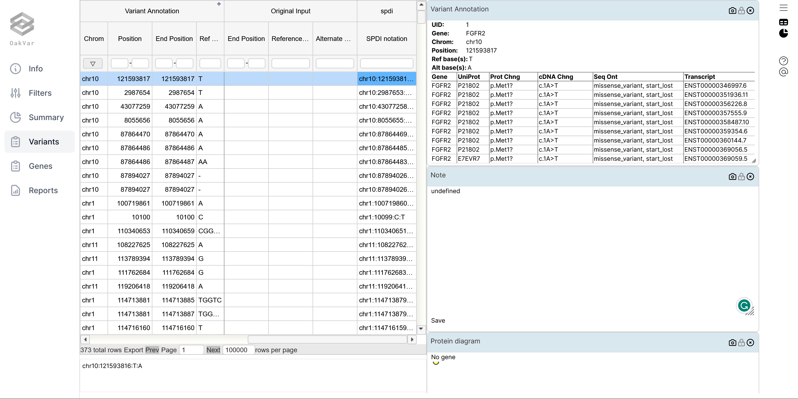

# spdi

The spdi annotation module. 

## SPDI Annotation Module

The spdi module converts OakVar's internal representation of variants, written in a csv file in a custom .crv format, into SPDI notation whose output returns the following dictionary - {"spdi": spdi_notation}.

## Usage

The spdi module can be run with the following command:

`ov run exampleinput -a spdi` `

where `exampleinput` is the name of the input file.

The output annotation can be viewed as a column in the variant annotation section using OakVar GUI with the following command:

`ov gui exampleinput.sqlite`

For e.g.:

## The .CRV format

The .crv format shows the internal representation of variants in OakVar. To see an example .crv file, follow the steps:

 Use `ov new exampleinput` to create an example variant input `exampleinput`. 
 
 Then, `ov run exampleinput --endat converter` will produce `exampleinput.crv` in the same directory.

The .crv file is essentially a csv file with the following:

First few rows are reserved for the meta data and are denoted with a `#` and are encapsulated in a JSON format.

The data itself consists for six columns:

1. `UID` - Unique identifier for the variant
2. `chrom` - The chromosome number
3. `pos` - The position of the variant
4. `pos_end` - The end position of the variant
5. `ref_base` - The reference allele
6. `alt_base` - The alternate allele

It is important to note that OakVar uses 1-based indexing for the position of the variant.

<h1>SPDI notation</h1>

SPDI notation is a standardized way of representing variants. It is a string of the following format:

1. `chrom` - The chromosome number
2. `pos` - The position of the variant
3. `del` - The number of bases deleted
4. `ins` - The inserted sequence

The SPDI notation uses  zero-based indexing for the position of the variant. It also uses left alignment for the variant in repeated regions. 

